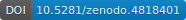
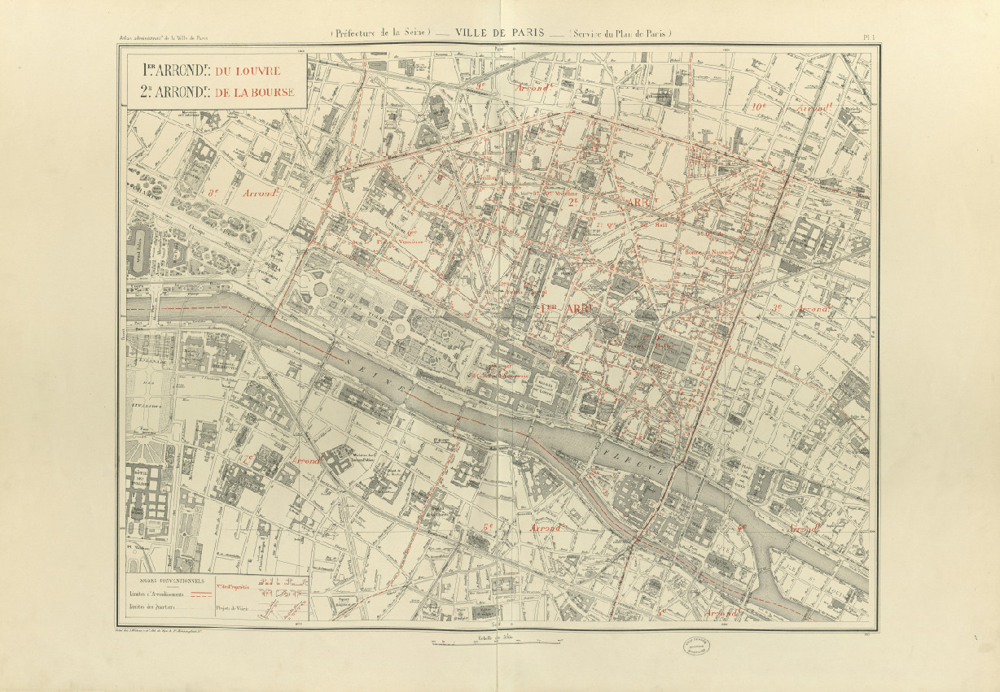
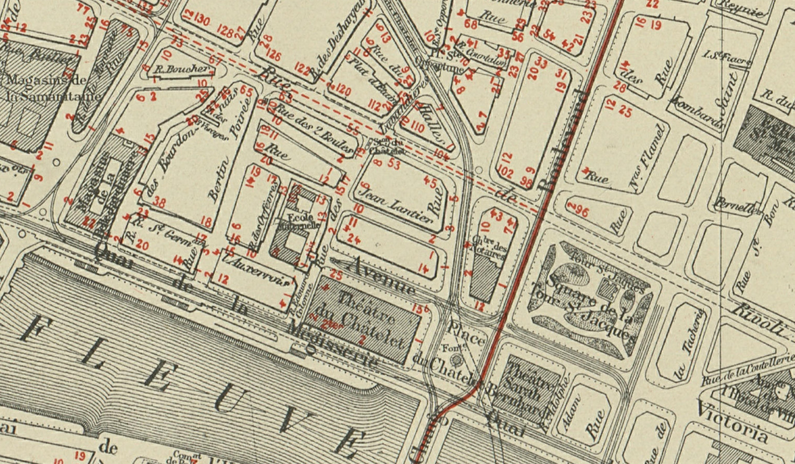
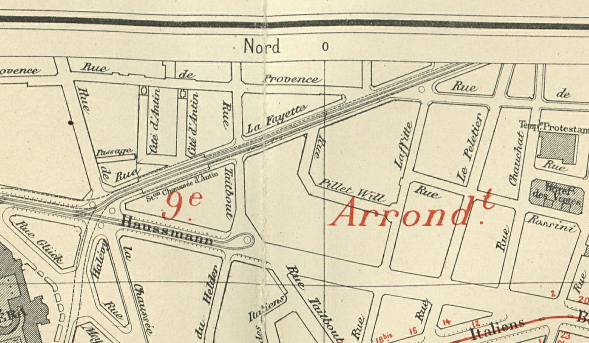

# Overview

## 🏆 Final results and material

The MapSeg challenge ran from November 2020 to April 2021,
with [🏆 winners for each three tasks](score_board.md)
who were invited to co-author the [competition report](https://arxiv.org/abs/2105.13265).
**We would like to thank all participants for their great submissions.**
<video style="max-width:100%; height:auto" controls>
    <source src="../res/Comp-ST_04-teaser.mp4" type="video/mp4">
    Sorry, your browser does not support the video tag.
    <br/>
    However, you can still download the video teaser by clicking <a href="res/Comp-ST_04-teaser.mp4">here</a>).
</video>
**All material is now available:**  
[](https://arxiv.org/abs/2105.13265)
   Competition report  
[](https://doi.org/10.5281/zenodo.4817662)
   Dataset with ground truth  
[](https://doi.org/10.5281/zenodo.4818228)
   Participants' submissions, detailed descriptions and evaluation reports  
[](https://doi.org/10.5281/zenodo.4818401)
   Evaluation tools  
…and [material for ICDAR presentation](icdar-material.md): [video teaser](res/Comp-ST_04-teaser.mp4), [slides](res/teaser_slides_v20210729-1106.pdf), [full presentation](res/presentation_slides_v20210729-1106.pdf) and [poster](res/poster_v3_A1_compressed.pdf).


To cite the competition, please cite the competition report:
```bibtex
@InProceedings{chazalon.21.icdar.mapseg,
  author    = {Joseph Chazalon and Edwin Carlinet and Yizi Chen and Julien Perret and Bertrand Dum\'enieu and Cl\'ement Mallet and Thierry G\'eraud and Vincent Nguyen and Nam Nguyen and Josef Baloun and Ladislav Lenc and and Pavel Kr\'al},
  title     = {ICDAR 2021 Competition on Historical Map Segmentation},
  booktitle = {Proceedings of the 16th International Conference on Document Analysis and Recognition (ICDAR'21)},
  year      = {2021},
  address   = {Lausanne, Switzerland},
}
```


<!-- OLD CONTENT -->

<!--
Generated using https://online.officetimeline.com
See source in timeline_data/source.xls
-->
<!-- <center> -->
<!-- [  ](img/timeline.png) -->
<!-- *Competition timeline ([link to larger view](img/timeline.png))* -->
<!-- </center> -->
<!-- 
<i class="fa fa-download fa-lg"></i> Downloads 
[Test set (Tasks 2-3)](downloads.md#test-inputs-for-task-2-and-3){: .btn  .btn-danger}
[Other sets](downloads.md){: .btn}
[Evaluation tools](downloads.md#evaluation-tools){: .btn}

<i class="fa fa-rss fa-lg"></i> Connect 
[Subscribe to updates](contact.md#subscribe-to-updates){: .btn}
-->

*Organized by*
*the [LASTIG](https://www.umr-lastig.fr/) team of the [IGN](https://ign.fr/) (the French National Mapping Agency),*
*the [R&D Lab](https://www.lrde.epita.fr/). of the [EPITA](https://www.epita.fr/) (French engineering school in computer science),*
*and the [Center of Historical Studies](http://crh.ehess.fr/) of the [EHESS](https://www.ehess.fr/) (French graduate schools of social sciences).*


*This work was partially funded by the French National Research Agency (ANR):*
*Project SoDuCo, grant [ANR-18-CE38-0013](https://anr.fr/Projet-ANR-18-CE38-0013).*
*We thank the [City of Paris](https://bibliotheques-specialisees.paris.fr/) for granting us with the permission to use and reproduce the atlases used in this work.*

<!-- 
## 📅 Important dates

| From       | To / On    | Title                                                                | Tasks |
| ---------- | ---------- | -------------------------------------------------------------------- | ----- |
|            | 2020-11-18 | Train and validation sets available                                  | all   |
| 2020-11-18 | 2021-04-05 | Training phase                                                       | all   |
|            | 2021-03-31 | Registration deadline for competition participants                   | all   |
|            | 2021-04-05 | Test datasets available                                              | 1     |
| 2021-04-05 | 2021-04-09 | Test phase                                                           | 1     |
|            | 2021-04-09 | Submission deadline for results                                      | 1     |
|            | 2021-04-12 | Test datasets available                                              | 2&3   |
| 2021-04-12 | 2021-04-16 | Test phase                                                           | 2&3   |
|            | 2021-04-16 | Submission deadline for results                                      | 2&3   |
| 2021-04-12 | 2021-04-23 | Write short method description                                       | all   |
|            | 2021-04-23 | Method descriptions due                                              | all   |
|            | 2021-07-01 | Full data disclosure: Ground truth for test set, participant results | all   |
-->

<!-- ## How to register?
Please check the [Registration page](registration.md). -->

<!-- ## How to download dataset and evaluation tools?
- The **train and validation sets** for all tasks are available under the [Downloads page](downloads.md).
- **Evaluation tools** will be **open sourced soon** so participant can check their results themselves.
- **Test sets** for all tasks will be released **at the start of the test phase.**
- **All competition material** (full dataset, participant results, evaluation tools) will be released publicly **at the end of the competition.** -->
## 🗺️ About the competition
This competition consisted in solving several challenges which arise during the digitization of historical maps.
We were particularly interested in a large map series consisting in many Paris atlases over half a century (1860's-1940's).
For each year, a set of approximately 20 sheets forms a tiled view of the city.
Such maps are highly detailed and very accurate even by modern standards.
The **graphical nature of the content** is visible in the full map sheet illustrated below.

<center>
 
*A sample map sheet ([link to larger version](img/map_large_in.jpg))* <!-- FIXME add really larger image -->
</center>

This material provides a very valuable resource for historians and a **rich body of scientific challenges** for the document analysis and recognition (DAR) community: map-related challenges (overlapping of many information layers) and document-related ones (document preservation).

<center>

*Excerpt showing map-related challenges*
</center>

<center>

*Excerpt showing document-related challenges*
</center>

We addressed tasks for three levels of scientific problems:

- [Task 1: Detection of building blocks](tasks/task1.md)
- [Task 2: Segmentation of map content within map sheets](tasks/task2.md)
- [Task 3: Localization of graticule lines intersections](tasks/task3.md)

These tasks are necessary step during the digitization of historical maps, i.e. when gradually turning a raster image into a set of vector geometries projected onto a particular geographical coordinate reference system.
Automatic approaches with good generalization power will provide an enormous gain for the Geographical Information Systems (GIS) communities looking for solutions when digitizing old maps,
and create a great potential for many historical studies.


<!-- ## 🚀 Key strengths for participants
- All datasets and evaluation tools are released with an **open license** as soon as they are available.
- Winners of each task will be invited to **co-author** the report paper.
- We propose unsolved research problems with an **important potential impact**. -->
  