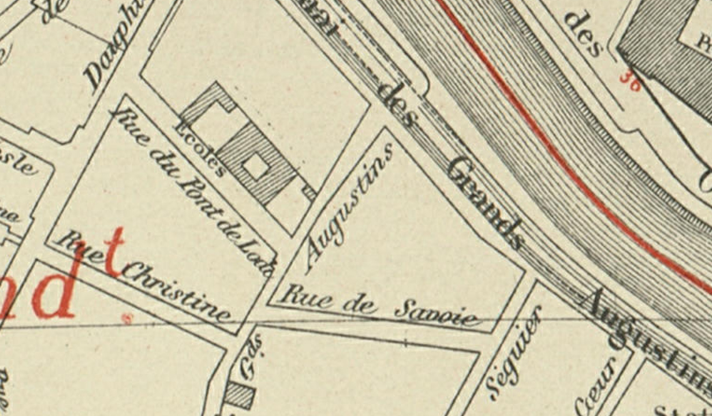
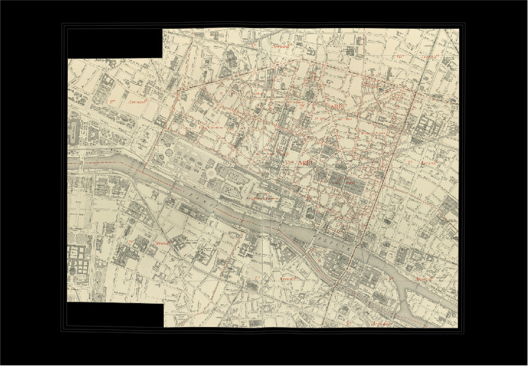
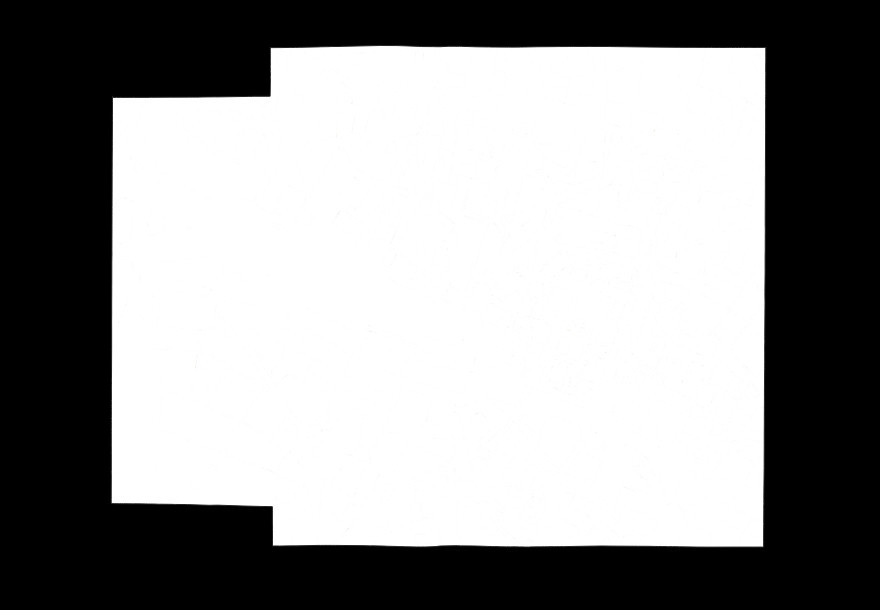
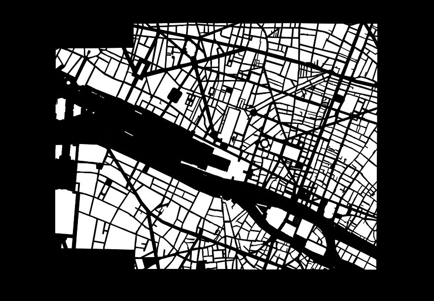

# Task 1: Detect Building Blocks
This task consists in detecting a set of closed shapes (building blocks) in the map image.

Building blocks are coarser map objects which can regroup several elements.
Detecting these objects is a critical step in the digitization of historical maps because it provides essential components of a city.
Each building block is symbolized by a closed which can enclose other objects and lines.
Building blocks are surrounded by streets, rivers fortification wall or others, and are never directly connected.
Building blocks can sometimes be reduced to a single spacial building, symbolized by diagonal hatched areas.


Given the image of a complete map sheet and a mask of the map area, you need to detect each building block, as illustrated below on a excerpt of the input.
<center>

*Excerpt of the input for task 1*
</center>

<center>

*Excerpt of the expected output for task 1*
</center>

We identified the following challenges:

1. Building blocks can have very variable sizes.
2. They can be reduced to a single building (diagonal hatched area).
3. Their contour can be damaged (ie non-closed).
4. Several other layers of information can be overlaid on building block outlines (text, railways, underground lines, graticule lines among others).
5. There may be decompositions inside a building block, increasing the number of edges to filter.
6. Building blocks may be large empty areas only surrounded by a contour. The lack of texture information and the variable sizes may be challenging to multiscale texture methods like convolutional neural networks.
7. Producing closed contours requires to embed strong guarantees in the method.


## Input
The inputs form a set of JPEG RGB images like the one illustrated below.
There are complete map sheet images cropped to the relevant area for which the non-relevant area is replaced by black pixels, as illustrated below.
Those images can be large (8000x8000 pixels).

<center>

*Sample input for task 1: non relevant pixels are replaced by black pixels.*
</center>

To help participants identify the non-relevant pixels, we also provide a mask image for which non-relevant pixels have value `0` and relevant pixels have value `255`, as illustrated below. Theses masks are the expected output for task 2 (cropped to the relevant part).

<center>

*Extra input mask for task 1 (exact same format as the output for task 2): indicates the masked content.*
</center>

## Ground truth and Expected outputs
Expected output for this task is a binary mask of the building blocks.
It must be stored in PNG (lossless) format with an 8-bit single channel.
Background must be indicated with pixel value 0, and building block areas with pixel value 255.
We will threshold the image to discard any other value.

The resulting image should look like the one below, which is the expected output for the sample input previously shown.

<center>

*Sample output for task 1*
</center>

Results need to be output in a PNG file with the exact same format and naming conventions as the ground truth, except for the `GT` part of the filename which should be changed into `PRED`:
if the input image is named `train/301-INPUT.jpg`, then the output file must be named `train/301-OUTPUT-PRED.png`.

## Dataset

Content for task 1 is located in the folder named `1-detbblocks` in the dataset archive.

### File naming conventions
Train, validation and test folder (if applicable) contain the same kind of files:

- `${SUBSET}/${NNN}-INPUT.jpg`:  
  JPEG RGB image containing the input image to process.
  This image was cropped to map content and irrelevant content (masked out by the mask file described below) are set to black (RGB=`(0,0,0)`).
  Those images can be large (10000x10000 pixels).  
  > *example:*  
  > `1-detbblocks/train/101-INPUT.jpg`
- `${SUBSET}/${NNN}-INPUT-MASK.png`:  
  PNG GREY image containing a mask of the map area (same size as input).
  While the image was cropped to the meaningful area, some elements need to be discarded (map legend for instance).
  Map area is indicated by pixels of value `255`; only predictions within this area is to be kept.  
  > *example:*  
  > `1-detbblocks/train/101-INPUT-MASK.png`
- `${SUBSET}/${NNN}-OUTPUT-GT.png`:  
  PNG GREY image containing a mask of expected building blocks (same size as input).
  Building blocks are indicated by pixels of value `255`; all other pixels (background and irrelevant) are set to `0`.
  > *example:*  
  > `1-detbblocks/train/101-OUTPUT-GT.png`


### Number of elements per set
- train: 1 image
- validation: 1 image
- test: 3 images


## Evaluation
For each map sheet, we extract the connected components from the predicted label mask.
Based on this set of regions, we compute the [COCO PQ score](https://cocodataset.org/#panoptic-eval) associated to the instance segmentation returned by your system.
Please note that as we have only 1 “thing” class and not “stuff” class, we provide indicators only for the building blocks class.
These simplifications required a custom implementation which is fully compliant with the COCO PQ evaluation code.

**We use 4-connectivity to compute labels from the binarized images of participants' predictions.**

### Metrics
We report 3 indicators:

- **COCO SQ** (segmentation quality): mean IoU between matching shapes (matching shapes in reference and prediction have an IoU > 0.5).  
  $`SQ \in [0,1]`$, higher is better.
- **COCO RQ** (detection/recognition quality): detection F-score for shapes, a predicted shape is a true positive if it as an IoU > 0.5 with a reference shape.  
  $`RQ \in [0,1]`$, higher is better.
- **COCO PQ** (aggregated score): $`PQ = SQ * RQ`$.  
  $`PQ \in [0,1]`$, higher is better.

The indicators are computed as: 
```math 
{\text{PQ}} = \underbrace{\frac{\sum_{(p, g) \in TP} \text{IoU}(p, g)}{\vphantom{\frac{1}{2}}|TP|}}_{\text{segmentation quality (SQ)}} \times \underbrace{\frac{|TP|}{|TP| + \frac{1}{2} |FP| + \frac{1}{2} |FN|}}_{\text{recognition quality (RQ)}}
```
where $`TP`$ is the set of matching pairs $`(p, g) \in (P \times G)`$ between predictions ($`P`$) and reference ($`G`$), $`FP`$ is the set of unmatched predicted shapes, and $`FN`$ is the set of unmatched reference shapes. 
Shapes are considered as matching when:
```math 
\text{IoU}(p,g) = \frac{p \cap g}{p \cup g} \gt 0.5.
```

### Using the evaluation tool
The [evaluation tool](../downloads.md#evaluation-tools) supports comparing either:

* a predicted segmentation to a reference segmentation (as two binary images in PNG or two label maps in TIFF16).
* a reference directory to a reference segmentation.  
  In this case, reference files are expected to end with ``-OUTPUT-GT.png``, and prediction files with ``-OUTPUT-PRED.png`` or ``-OUTPUT-*.tiff``.


Comparing two files:

```console
$ icdar21-mapseg-eval T1 201-OUTPUT-GT.png 201-OUTPUT-PRED.png output_dir
201-OUTPUT-PRED.png - COCO PQ 1.00 = 1.00 SQ * 1.00 RQ
```

Comparing two directories:

```console
$ icdar21-mapseg-eval T1 1-detbblocks/validation/ mypred/t1/validation/ output_dir
Processing |################################| 1/1
                                       COCO PQ  COCO SQ  COCO RQ
Reference         Prediction                                  
201-OUTPUT-GT.png 201-OUTPUT-PRED.png      1.0      1.0      1.0
==============================
Global score for task 1: 1.000
============================
```

### Files generated in output folder
The output directory will contain something like:

```text
201-OUTPUT-GT.plot.pdf 
global_coco.csv        
global_score.json      
```

Detail:

- `global_coco.csv`:  
  COCO metrics for each image.
- `global_score.json`:  
  Easy to parse file for global score with a summary of files analyzed.
- `NNN-OUTPUT-PRED.plot.pdf`:  
  Plot of the F-score against all IoU thresholds (COCO PQ is the area under the F-score curve + the value of the F-score at 0.5).
