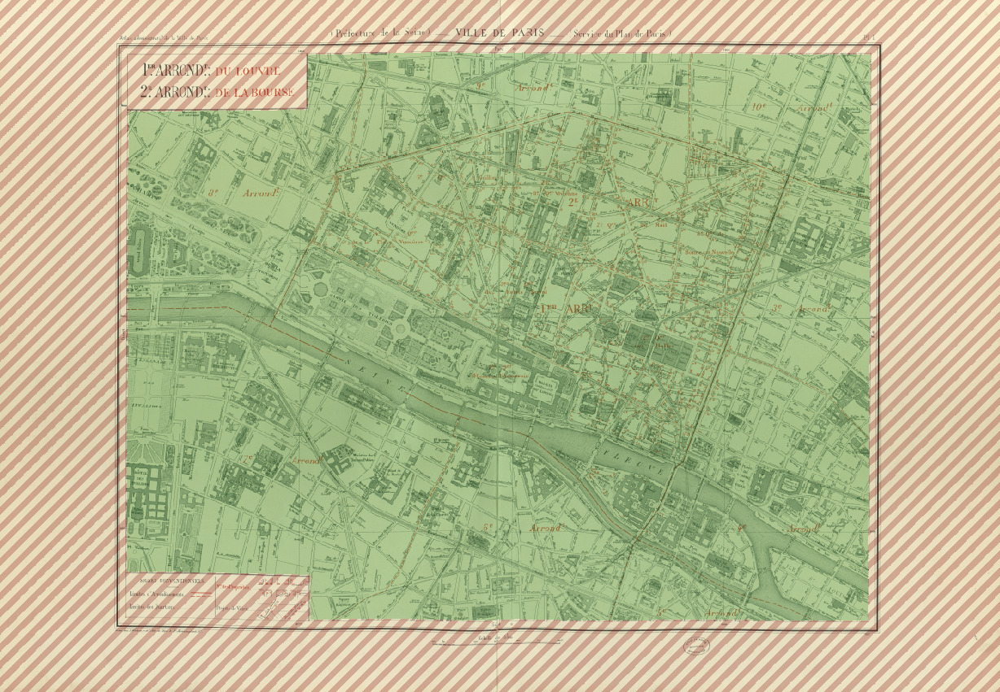

# Task 2: Segment Map Content Area
This task consists in segmenting the map content from the rest of the sheet.

This is a rather classical document analysis task as it consist in focusing on the relevant area in order to perform a dedicated analysis. In our case, task 1 would be the following stage in the pipeline.

Given the image of a complete map sheet, you need to locate the boundary of the map content, as illustrated below.
<center>

*Illustration of expected outputs for task 2: green area is the map content and red hatched area is the background.*
</center>


We identified the following challenges:

1. The map area is usually well separated from the other elements (title, legend, scale…) by several frames but sometimes map contents exceeds the frame for some large objects.
2. The frame itself is not straight and can be damaged.


## Input
**Note that the inputs for this task are the same as task 3.**

The inputs form a set of JPEG RGB images like the one illustrated below.
There are complete map sheet images.
Those images can be large (10000x10000 pixels).

<center>

*Sample input for task 3*
</center>


## Ground truth and Expected outputs
Expected output for this task is a binary mask of the map content area.
It must be stored in PNG (lossless) format with an 8-bit single channel.
Background must be indicated with pixel value 0, and map content area with pixel value 255.
We will threshold the image to discard any other value.

The resulting image should look like the one below, which is the expected output for the sample input previously shown.

<center>

*Sample output for task 2*
</center>

Results need to be output in a PNG file with the exact same format and naming conventions as the ground truth, except for the `GT` part of the filename which should be changed into `PRED`:
if the input image is named `train/301-INPUT.jpg`, then the output file must be named `train/301-OUTPUT-PRED.png`.

## Dataset
Content for task 2 is located in the folder named `2-segmaparea` in the dataset archive.

### File naming conventions
Train, validation and test folder (if applicable) contain the same kind of files:

- `${SUBSET}/${NNN}-INPUT.jpg`:  
  JPEG RGB image containing the input image to process.
  There are complete map sheet images.
  Those images can be large (10000x10000 pixels).  
  > *example:*  
  > `2-segmaparea/train/101-INPUT.jpg`
- `${SUBSET}/${NNN}-OUTPUT-GT.png`:  
  PNG GREY image containing a mask of expected map are (same size as input).
  Map area is indicated by pixels of value `255`; all other pixels are set to `0`.
  > *example:*  
  > `2-segmaparea/train/101-OUTPUT-GT.png`


### Number of elements per set

- train: 26 images
- validation: 6 images
- test: 95 images

## Evaluation

To evaluate the quality of the segmentation, we will compute the [Hausdorff distance](https://en.wikipedia.org/wiki/Hausdorff_distance) between the expected shape do detect and the predicted one.
**This implies that there is only one (connected, without hole) shape to detect.**
This measure has the advantage over the “intersection over union”, “Jaccard index” and other area measures that it keeps a good “contrast” between results in the case of large objects (because there is no normalization by the area).

### Metric
More specifically, we will use the “Hausdorff 95” variant which discards the 5 percentiles of higher values (assumed to be outliers) to produce a more stable measure.

Finally, we will compute the average of the measures for all individual map images to produce a global indicator with a confidence measure.

The resulting measure is a float value between 0 and a large value.
A lower value is better.

### Tool sample usage
The [evaluation tool](../downloads.md#evaluation-tools) supports comparing either:

* a predicted segmentation to a reference segmentation (as two binary images)
* a reference directory to a reference segmentation
  In this case, reference files are expected to end with ``-OUTPUT-GT.png``, and prediction files with ``-OUTPUT-PRED.png``.


Comparing two files:

```console
$ icdar21-mapseg-eval T2 201-OUTPUT-GT.png 201-OUTPUT-PRED.png output_dir
201-OUTPUT-PRED.png - Haussdorff95 = 0.00
```

Comparing two directories:

```console
$ icdar21-mapseg-eval T2 ./2-segmaparea/validation mypred/t2/validation output_dir
.../PIL/Image.py:2847: DecompressionBombWarning: Image size (137239200 pixels) exceeds limit of 89478485 pixels, could be decompression bomb DOS attack.
Processing |################################| 6/6
                                     Error
Reference         Prediction              
201-OUTPUT-GT.png 201-OUTPUT-GT.png    0.0
202-OUTPUT-GT.png 202-OUTPUT-GT.png    0.0
203-OUTPUT-GT.png 203-OUTPUT-GT.png    0.0
204-OUTPUT-GT.png 204-OUTPUT-GT.png    0.0
205-OUTPUT-GT.png 205-OUTPUT-GT.png    0.0
206-OUTPUT-GT.png 206-OUTPUT-GT.png    0.0
==============================
Global error for task 2: 0.000
```

<i class="fa fa-info-circle fa-2x"></i>
Because the PNG files are large, you may get a warning from PIP that you can safely ignore:  
`DecompressionBombWarning: Image size (137239200 pixels) exceeds limit of 89478485 pixels, could be decompression bomb DOS attack.`

### Files generated in output folder
When processing directories, the output directory will contain the following files:

- `global_error.json`:  
  Easy to parse file for global score with a summary of files analyzed.
- `global_hd95.csv`:  
  HD95 metrics for each image.
