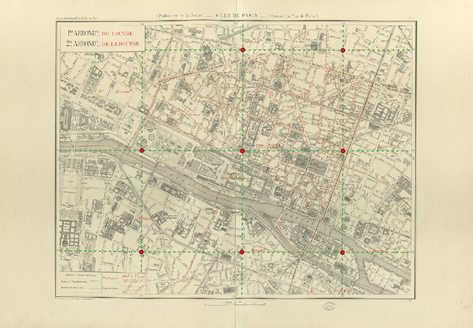
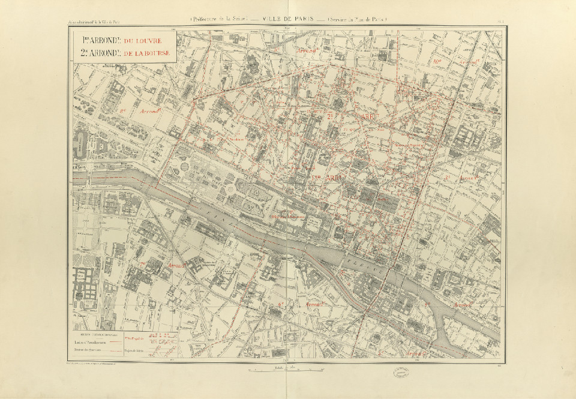
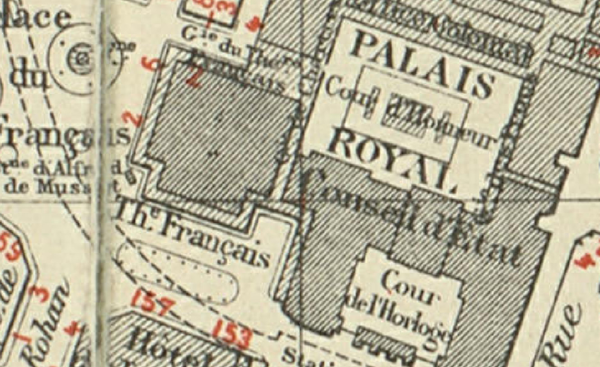

# Task 3: Locate Graticule Lines Intersections
This task consists in locating the intersection points of graticule lines.

Graticule lines are lines indicating the North/South/East/West major coordinates in the map.
They are drawn every 1000 meters in each direction and overlap with the rest of the map content.
Their intersections are very useful to geo-reference the map image, ie for projecting map content in a modern [geographical coordinate reference system](https://docs.qgis.org/3.16/en/docs/gentle_gis_introduction/coordinate_reference_systems.html).

Given the image of a complete map sheet, you need to locate the intersection points of such lines, as illustrated below.
<center>

*Illustration of expected outputs for task 3: dashed green lines are the graticule lines and red dots are the intersections points to locate.*
</center>


We identified the following challenges:

1. Theses lines, while crossing the map from edge to edge, may not be horizontal and vertical but sometimes diagonal.
2. They can be damaged and locally curbed.
3. They overlap numerous map content and can touch other parallel segments.


## Input
**Note that the inputs for this task are the same as task 2.**

The inputs form a set of JPEG RGB images like the one illustrated below.
There are complete map sheet images.
Those images can be large (10000x10000 pixels).

<center>

*Sample input for task 3*
</center>

<center>

*Close view of a sample input for task 3*
</center>


## Ground truth and Expected outputs
Expected output for this task is a list of coordinates (in image referential, ie. `0,0` at top left, x axis pointing to the right and y axis pointing downward).

Coordinates need to be output in a CSV file with the exact same format and naming conventions as the ground truth, except for the `GT` part of the filename which should be changed into `PRED`:
if the input image is named `train/301-INPUT.jpg`, then the output file must be named `train/301-OUTPUT-PRED.csv`.

The format of the CSV is the same as the one of the ground truth described below.

The CSV should look like:
```csv
x,y
2379.0,2338.0
2373.2,4708.2
4744.2,2332.8
4736.5,4724.5
```

Each CSV line should indicate an intersection like the one illustrated below.

<center>

*Close view of an intersection point to detection for task 3: you can see that many graphical elements can disrupt the detection of such element.*
</center>

## Dataset
Content for task 3 is located in the folder named `3-locglinesinter` in the dataset archive.

**WARNING: because the inputs of this task are exactly the same as task 2, we did not duplicate them.**
*Please copy or link the `2-segmaparea/{train,validation,test}/*-INPUT.jpg` files accordingly.*

### File naming conventions
Train, validation and test folders (if applicable) contain the same kind of files:

- `${SUBSET}/${NNN}-INPUT.jpg`:  
  JPEG RGB image containing the input image to process.
  There are complete map sheet images.
  Those images can be large (10000x10000 pixels).  
  > *example:*  
  > `2-segmaparea/train/101-INPUT.jpg`
- `${SUBSET}/${NNN}-OUTPUT-GT.csv`:  
  CSV file containing a list of intersection coordinates (detailed below).  
  > *example:*  
  > `2-segmaparea/train/101-OUTPUT-GT.csv`


### Number of elements per set

- train: 26 images
- validation: 6 images
- test: 97 images


### CSV file format

- first line: header (always `x,y`)
- other lines: two floats
- delimiter: comma (`,`)
- float format: dot (`.`) as decimal separator, 1 digit after the dot (sub-pixel accuracy)
- coordinate system: image: `(0,0)` is at top left, x axis points to the right and y axis points downward


*CSV example:*
```csv
x,y
2379.0,2338.0
2373.2,4708.2
4744.2,2332.8
4736.5,4724.5
```

## Evaluation

For each map sheet (i.e. for each CSV result), we will compare the predicted coordinates with the expected ones.
We will report an aggregated indicator (*PDS* for “Points Detection Score”) which considers detection and localization accuracy simultaneously.

### Metric
We will compute for each map sheet the number of correct predictions for each possible distance threshold:

- a predicted point will be considered as a correct detection if it is the closest predicted point of a ground truth (expected) point and the distance between the expected point and the predicted one is smaller than a given threshold
- we will consider all possible thresholds between 0 and 50 pixels, which roughly represents 20 meters on the maps and gives an upper limit over which the registration would be seriously disrupted.

For each possible threshold we can compute the number of correct predictions, the number of incorrect ones (the complement of the prediction set) and the number of expected elements.
This allows us to plot a $`F_{\beta}`$ score vs threshold curve for a range of thresholds.
The $`F_{\beta}`$ score with $`\beta=0.5`$ [weights recall lower than precision](https://en.wikipedia.org/wiki/F-score) because for this task it takes several good detections to correct a wrong one in the final registration.

We will take the area under this “*$`F_{0.5}`$ score vs threshold*” curve as a performance indicator:
such indicator blends two indicators: point detection and spatial accuracy.

Finally, we will compute the average of the measures for all individual map images to produce a global indicator with a confidence measure.

The resulting measure is a float value between 0 and 1.
A higher value is better.

### Tool sample usage
The [evaluation tool](../downloads.md#evaluation-tools) supports comparing either:

* a predicted detection to a reference detection (as two CSV files)
* a reference directory to a reference detection
  In this case, reference files are expected to end with ``-OUTPUT-GT.csv``, and prediction files with ``-OUTPUT-PRED.csv``.

Comparing two files:

```console
$ icdar21-mapseg-eval T3 201-OUTPUT-GT.csv 201-OUTPUT-PRED.csv output_dir
201-OUTPUT-PRED.csv - Score: 1.000
```

Comparing two directories:

```console
$ icdar21-mapseg-eval T3 ./3-locglinesinter/validation mypred/t3/validation output_dir
Processing |################################| 6/6
                                       Score
Reference         Predictions               
201-OUTPUT-GT.csv 201-OUTPUT-PRED.csv    1.0
202-OUTPUT-GT.csv 202-OUTPUT-PRED.csv    1.0
203-OUTPUT-GT.csv 203-OUTPUT-PRED.csv    1.0
204-OUTPUT-GT.csv 204-OUTPUT-PRED.csv    1.0
205-OUTPUT-GT.csv 205-OUTPUT-PRED.csv    1.0
206-OUTPUT-GT.csv 206-OUTPUT-PRED.csv    1.0
==============================
Global score for task 3: 1.000
==============================
```


### Files generated in output folder
The output directory will contain something like:
```text
201-OUTPUT-PRED.clf.pdf 
201-OUTPUT-PRED.eval.csv
201-OUTPUT-PRED.plot.csv
201-OUTPUT-PRED.plot.pdf
...
global_rad:50_beta:0.50.csv
global_score.json
```

Detail:

- `global_rad:50_beta:0.50.csv`:  
  global score for each pair of files (ground truth, prediction).
- `global_score.json`:  
  Easy to parse file for global score with a summary of files analyzed, and values for evaluation parameters.
- `nnn-OUTPUT-PRED.eval.csv`:  
  CSV file with all intermediate metrics (precision, recall, f_beta, tps, fns, fps, etc.) computed for each detected point.
- `nnn-OUTPUT-PRED.plot.csv`:  
  Source values used to generate the curve to plot.
- `nnn-OUTPUT-PRED.plot.pdf`:  
  Plot of the curve used to compute the global metric.
- `nnn-OUTPUT-PRED.clf.pdf `:  
  A visualization of predictions and their error classification against the ground truth.

You can check the [Demo analysis notebook for task 3](https://github.com/icdar21-mapseg/icdar21-mapseg-eval/notebooks/task3_point_detect_eval_demo.ipynb) for further details about the evaluation tools for task 3.